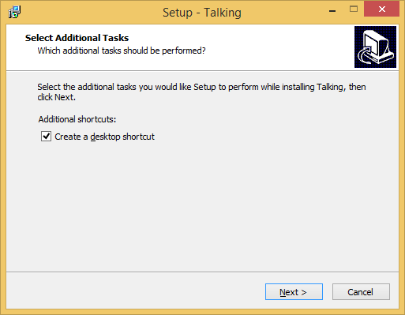
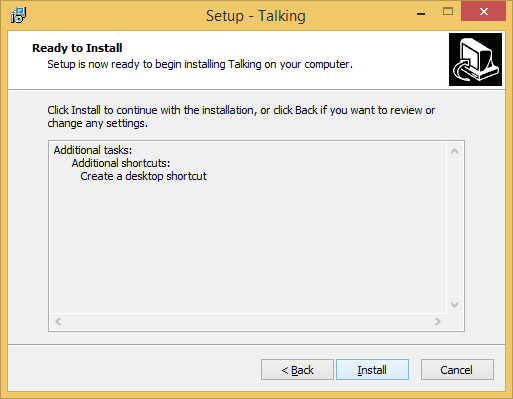
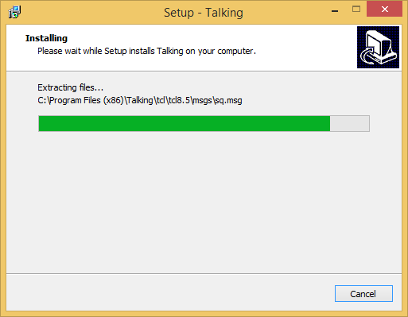
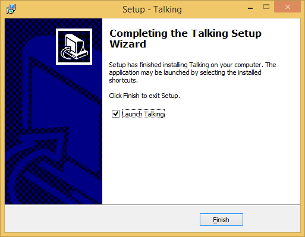
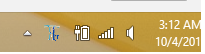

				Welcome to Talking!

##### Machine Learning Framework for Process Mapping. This application is designed for factory environment of opertaions business.

> - Talking Windows App collects process specific structured data for Process Mapper Algorith
> - Talking Process Making Automation Using Machine Learning
> - The provided windows app captures the daily activities in a structured manner for machine learning purpose.
> - Privacy - The Talking App is targeted for industrial applications for discovering the granular level processes followed by various teams. In future versions, you will get more features of blocking sites or apps from being monitored for process mapping.
> -  All sensitive data is securely managed and destroyed upon analysis. It may take upto 48 hours fro analysis.
> -  We value human privacy and sensitivity of this matter.

### Installation

> -  Download the Windows application installer
> - **Install**   .
> - Obtain & Save License in C:\Talking\talking.cfg folder (**Read Signup section below**)
> -  Double click on Talking Desktop icon to **Run**  .
> - You can exit the application by Talking icon in taskbar. 

### Signup

> - TALKING Process Mapping AI Framework is designed to analyse and present process maps followed among your workforce. The processes are discovered by collecting sufficiently large amounts of data to be processed through machine learning specifically designed for this purpose. You can setup **private** analytics or signup for **our Secure & Compliant** processing service.
> - Signup is **easy**. Log on to https://app.talking.one/register . Provide all the details and submit.
> - You will recieve a confirmation mail. To manage genuine users, we ask you click on an activation email. Welcome onboard!
> - Setup users(your **workforce** ) in https://app.talking.one/#/organization

> 3 Step for Setup: 
> - > - [1] Add a Department
> - > -	[2] Add Team for Department
> - > -	[3] Add Members(users) for Team
>
> - Download license files **talking.cfg** for each user  
> - The talking.cfg files for each user must be saved in respective computer's folder( **C:\Talking** ), as mentioned in **Installation** section above.
> - You can view the status of mapping and completed process maps  https://app.talking.one

> **Cloud Rates:**
- USD 100 per Month per Person
- Contact us for on-premise deployment

#### Contact

:email: support@talking.on

:link: [Talking.One](https://www.talking.one)

